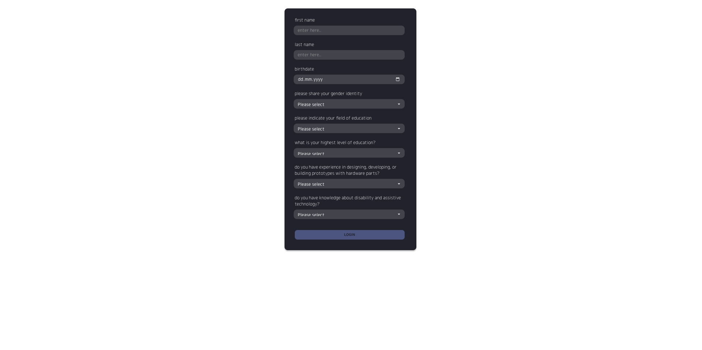
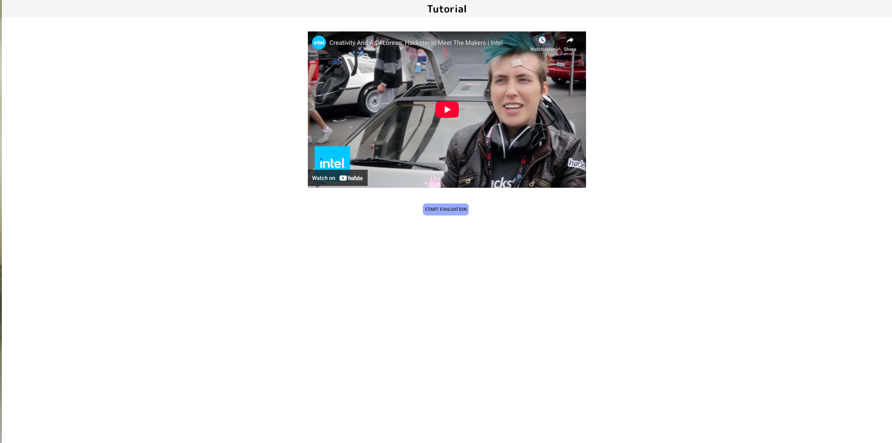
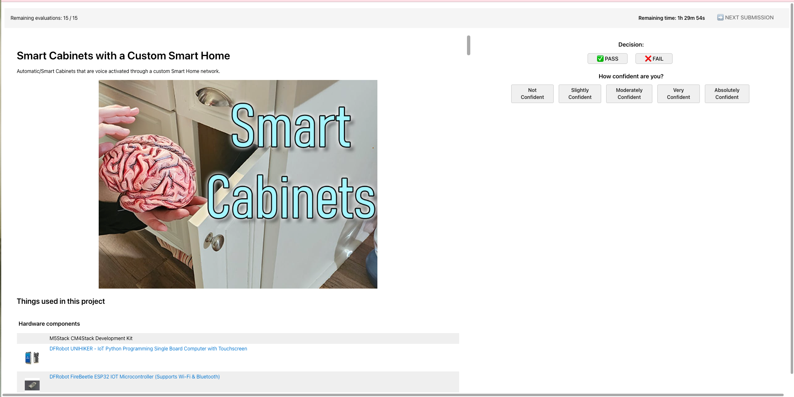
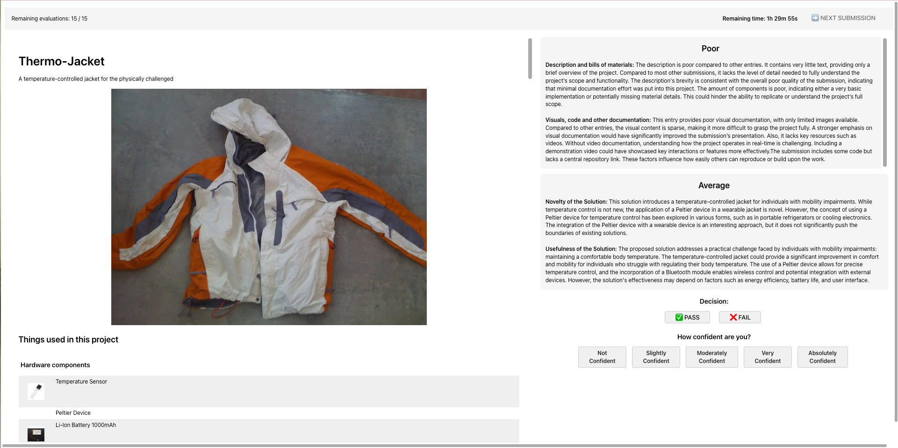
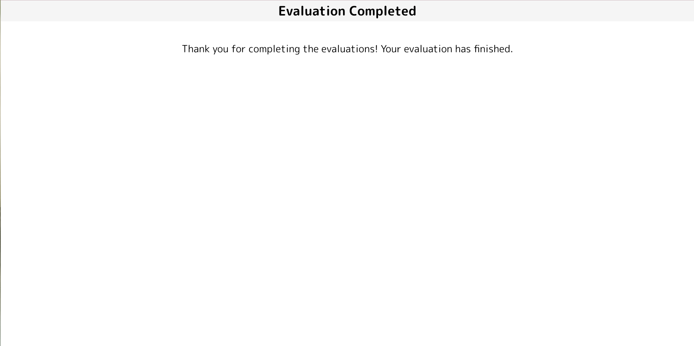

# Hackster Evaluation Web Interface 2025 -- Client Template

## Introduction

The client application consists of four main pages designed to facilitate the evaluation process:

1. **Login Page**: Collects evaluator identification and demographic information
    

2. **Tutorial Page**: Provides an introduction to the evaluation methodology and process
    

3. **Evaluation Page**: Displays content customized according to the assigned evaluation condition. The interface varies based on experiment requirements, with four distinct evaluation conditions available. Below are examples from two conditions:

    
    

4. **Ending Page**: Confirms completion of the evaluation session and provides any necessary follow-up information
    

 This initial implementation focuses on core functionality for testing purposes. The user interface will be refined based on feedback from preliminary evaluations.

## License and Copyrights

This project is proprietary software developed for research purposes only.

- **Usage Restrictions**: For private use exclusively within the authorized research team.
- **Distribution**: Not permitted. Do not share, distribute, or make this code available to unauthorized parties.
- **Intellectual Property**: All rights reserved. The contents of this repository are protected under applicable copyright laws.

For questions regarding usage permissions, please contact the repository maintainers.

